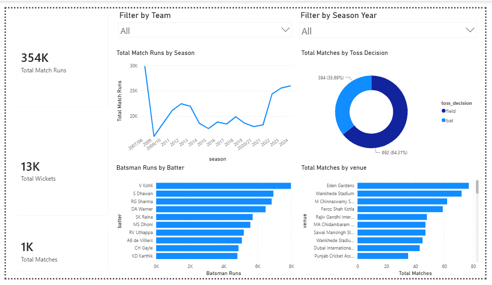

# IPL Analytics: End-to-End Data Pipeline & Executive Dashboard (2008 – 2024)



---

## 📌 Executive Summary

This project delivers a full-stack, end-to-end data analytics pipeline analyzing 17 seasons of Indian Premier League (IPL) cricket data (2008–2024). The pipeline moves from raw dataset ingestion and programmatic data cleaning in Python, through relational data modeling and analytical querying in SQL, to final interactive data visualization and custom DAX modeling in Power BI.

---

## 🛠 Data Pipeline Architecture

```text
[ Raw CSV Files ]
        │
        ▼ (Python / Jupyter Notebook)
[ Data Cleaning & Normalization ]
        │
        ▼ (SQL Database)
[ Relational Schema & Analytical Queries ]
        │
        ▼ (Power BI Desktop)
[ DAX Measures & Executive Dashboard ]
```

1. **Data Ingestion & Cleaning (Python):** Handled missing values, standardized inconsistent string entries (e.g. `NA`, `nan`, blank dismissal kinds), fixed historical team renames across seasons, and exported processed datasets.
2. **Data Modeling & Storage (SQL):** Loaded structured data into relational tables (`matches`, `deliveries`), enforced a primary/foreign key relationship on `match_id`, and executed aggregation queries to validate ground-truth metrics.
3. **Data Visualization & Analytics (Power BI):** Imported cleaned data, engineered custom DAX measures for dynamic KPIs, and designed a single-page executive dashboard with slicers for interactive filtering.

---

## 📁 Repository Structure

```text
ipl-end-to-end-data-pipeline/
│
├── data/
│   ├── raw/
│   │   ├── matches.csv
│   │   └── deliveries.csv
│   └── processed/
│       ├── cleaned_matches.csv
│       └── cleaned_deliveries.csv
│
├── notebooks/
│   └── ipl_data_cleaning.ipynb
│
├── sql/
│   ├── schema_setup.sql
│   └── analytical_queries.sql
│
├── power_bi/
│   ├── IPL_Analytics.pbix
│   ├── DAX_Measures.md
│   └── dashboard_preview.png
│
└── README.md
```

---

## 📊 Key Insights & Analytical Takeaways

- **Scale of Analysis:** Processed ~354K total runs, ~13K wickets, and over 1,000 matches across 17 seasons.
- **Toss Decision Strategy:** Teams winning the toss chose to field first roughly 64% of the time, reflecting a strong strategic bias toward chasing in modern IPL venues.
- **Top Batting Performers:** Top historical run-scorers include V Kohli, S Dhawan, and RG Sharma.
- **Venue Trends:** Certain venues (e.g. Eden Gardens, Wankhede Stadium) host a disproportionately high volume of matches and total runs.

---

## 💻 Tech Stack & Tools

- **Languages:** Python (Pandas, NumPy), SQL, DAX
- **Environment:** Jupyter Notebook, MySQL Workbench
- **Business Intelligence:** Power BI Desktop
- **Version Control:** Git, GitHub

---

## 🔧 Deep Dive: Step-by-Step Pipeline Implementation

### 1. Python Data Cleaning (`notebooks/ipl_data_cleaning.ipynb`)

- Standardized rebranded team names (e.g. Delhi Daredevils → Delhi Capitals) across `team1`, `team2`, `winner`, and `toss_winner`.
- Filled missing values in `winner` and `city` columns.
- Exported cleaned datasets as `cleaned_matches.csv` and `cleaned_deliveries.csv`.

### 2. SQL Schema & Analytical Queries (`sql/`)

Example query used to validate toss-decision impact before building the dashboard:

```sql
-- Total matches by toss decision, with win percentage
SELECT
    toss_decision,
    COUNT(*) AS total_matches,
    ROUND(
        SUM(CASE WHEN toss_winner = winner THEN 1 ELSE 0 END) * 100.0 / COUNT(*),
        2
    ) AS win_percentage
FROM matches
WHERE winner != 'No Result'
GROUP BY toss_decision;
```

### 3. Power BI DAX Modeling (`power_bi/DAX_Measures.md`)

Core measures used to drive the dashboard's KPI cards and visuals:

```dax
Total Match Runs = SUM(deliveries[batsman_runs]) + SUM(deliveries[extra_runs])

Batsman Runs = SUM(deliveries[batsman_runs])

Total Wickets =
CALCULATE(
    COUNTROWS(deliveries),
    NOT(ISBLANK(deliveries[player_dismissed])),
    NOT(deliveries[player_dismissed] IN {"", "0", "NA", "nan", "None"})
)

Total Matches = COUNTROWS(matches)
```

---

## 🚀 How to Run & Reproduce

1. **Clone the repository:**
   ```bash
   git clone https://github.com/your-username/ipl-end-to-end-data-pipeline.git
   cd ipl-end-to-end-data-pipeline
   ```

2. **Run Python data preprocessing:**
   Open `notebooks/ipl_data_cleaning.ipynb` in Jupyter Notebook or VS Code and execute all cells.

3. **Set up the database:**
   Execute `sql/schema_setup.sql` and `sql/analytical_queries.sql` in MySQL Workbench (or your SQL client of choice).

4. **Explore the dashboard:**
   Open `power_bi/IPL_Analytics.pbix` in Power BI Desktop to interact with visuals, slicers, and DAX measures.

---

## 📷 Dashboard Preview

The final dashboard is a single-page executive overview featuring:
- KPI cards for Total Runs, Total Wickets, and Total Matches
- A chronological line chart of runs by season (2008–2024)
- A horizontal bar chart of top run-scorers
- A donut chart of toss decision distribution
- Dropdown slicers for Team and Season filtering
